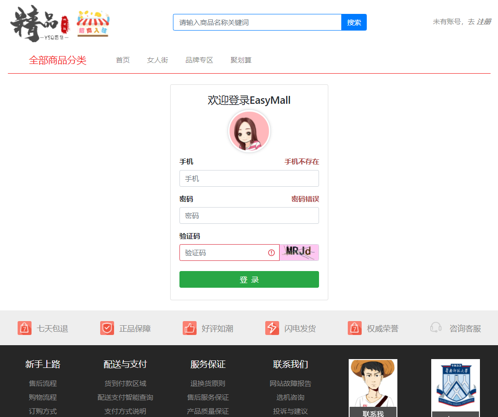
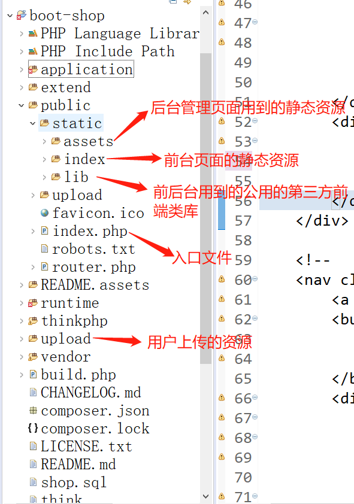

# 项目简介
> ​	该项目是用 tp5 构建的基于单机架构的小商城。由于学习需要，我们正使用 bootstrap4 对商城前台的主要页面进行重构，使之在手机上亦能呈现不错的显示效果

# 效果图

项目演示地址：http://shop.ysqorz.top/




# 项目运行

> ​	为了方便查看效果，我去除了所有的 .gitignore 文件，将所有的静态资源文件，包括项目中上传的图片均上传至仓库。这些上传的图片的相对路径与数据库数据对应，如果缺少或者被移动，将会导致运行后无法显示。



> 1. 克隆项目，把项目放到 www 目录下面
>2. 导入数据库。通过 navicat 等可视化界面操作。创建数据库 ```shop```。 执行项目中的 脚本文件```shop.sql```，将数据导入到新建的数据库。
> 3. 由于入口文件在 public 目录下，故访问注册页面的路径为：http://localhost/boot-shop/public/index/member/register

# 开发注意事项（补充中...）

> 1. 浏览器会缓存 js，css，图片等静态资源，有时候改动了这些文件需要，清除浏览器缓存后刷新才生效。为了方便调试，我们不把 js 放到单独的文件，而是直接在 html 页面的 ```<script></script>```中写 js。参照 注册页面！！！

# 项目部署上线

> ​	目前仓库的版本是在windows 10上运行的开发版。当项目基本完成，部署到云服务器上前，需要对某些地方的代码进行修改。
>
> ​	暂略...

